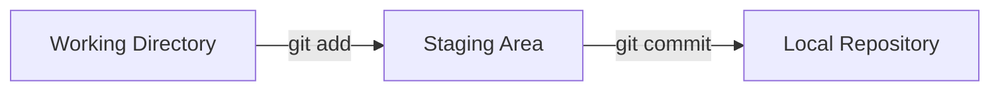

# 📘 Git & GitHub Basics

> **A hands-on beginner's guide to understanding Git, GitHub and the workflow developers actually use.**

---

# 🚀 1. Welcome to Git & GitHub

Git is a **version control system**.

It helps you track changes in your projects over time.

Imagine you're working on a project and you reach this point:

```text
Monday
Project works ✅

Tuesday
Added new feature ✅

Wednesday
Everything broke 💀
```

Without version control, you might have no idea what changed.

With Git, you can see your project's history and move between versions.

### Git helps you:

- Track changes
- Save versions of your project
- Experiment safely
- Work with other developers
- Recover from mistakes

---

# ☁️ 2. So... What Is GitHub?

Git and GitHub are **not the same thing**.

### Git

Git is the version control tool running on your computer.

### GitHub

GitHub is an online platform where Git repositories can be stored, shared and collaborated on.

Think:

```text
Git
│
├── Tracks your project history
├── Runs locally
└── Helps manage versions

GitHub
│
├── Hosts repositories online
├── Enables collaboration
├── Pull Requests
├── Issues
└── Code sharing
```

### 🧠 Remember

> **Git = the tool**
>
> **GitHub = the platform**

---

# 🔍 3. Git vs GitHub

| Git | GitHub |
|---|---|
| Version control system | Online development platform |
| Runs locally | Runs on the internet |
| Tracks changes | Hosts repositories |
| Creates commits | Stores remote repositories |
| Creates branches | Enables collaboration |
| Works without internet | Usually requires internet |

You can use Git without GitHub.

You cannot replace Git simply by using GitHub.

---

# 🕐 4. Why Do We Need Version Control?

Imagine five developers editing the same project.

Without version control:

```text
final.zip
final2.zip
final-final.zip
final-final-REAL.zip
final-final-REAL-new.zip
final-final-REAL-new-fixed.zip
```

😭

Git gives you something much better:

```text
Commit 1
   ↓
Commit 2
   ↓
Commit 3
   ↓
Commit 4
```

Every commit represents a meaningful point in your project's history.

---

# ⚙️ 5. Installing Git

First check whether Git is already installed.

Open your terminal and run:

```bash
git --version
```

You should see something similar to:

```text
git version 2.x.x
```

If you see a version number, Git is installed.

---

# 👤 6. Configure Git

Tell Git who you are.

```bash
git config --global user.name "Your Name"
```

Then:

```bash
git config --global user.email "you@example.com"
```

Check your configuration:

```bash
git config --list
```

### 💡 Why?

Every commit records the author information configured in Git.

---

# 📁 7. Your First Git Repository

Create a folder for your project.

Example:

```bash
mkdir git-workshop-demo
```

Move inside it:

```bash
cd git-workshop-demo
```

Now initialize Git:

```bash
git init
```

Git will create a hidden `.git` directory.

That directory contains the information Git needs to track your project.

---

# 👀 8. Check What's Happening

Run:

```bash
git status
```

Git tells you what is happening inside your repository.

This is one of the commands you should use **constantly**.

### 🧠 Pro Tip

When you're confused:

```bash
git status
```

is often your first move.

---

# ✏️ 9. Create Your First File

Create a file called:

```text
README.md
```

Put something inside it:

```markdown
# My First Git Project

I am learning Git!
```

Now run:

```bash
git status
```

Git should show the file as **untracked**.

That means:

> "I can see this file, but you haven't asked me to track it yet."

---

# 📦 10. Stage Your Changes

Tell Git to start tracking the file:

```bash
git add README.md
```

Now:

```bash
git status
```

The file should appear under **Changes to be committed**.

### What's happening?

```text
Working Directory
       ↓
     git add
       ↓
Staging Area
```

You have selected the change you want included in your next commit.

---

# 💾 11. Create Your First Commit

Now commit the staged change:

```bash
git commit -m "Add README"
```

A commit is a saved snapshot in your Git history.

Check it:

```bash
git log --oneline
```

You should see something similar to:

```text
a1b2c3d Add README
```

The random-looking characters are part of the commit's identifier.

---

# 🧠 12. The Basic Git Workflow

This is the workflow you should remember:

```text
EDIT
  ↓
git status
  ↓
git add
  ↓
git commit
```

Or visually:



This is the heart of Git.

---

# 🔎 13. Seeing Your Changes

Modify your README.

For example:

```markdown
I am learning Git and GitHub.
```

Now run:

```bash
git diff
```

Git shows what changed since your last commit.

This is extremely useful before committing.

---

# 🌿 14. Branches

A branch allows you to work on a separate line of development.

Imagine your main project is:

```text
main
 │
 ├── Commit A
 ├── Commit B
 └── Commit C
```

You want to experiment with a new feature.

Create a branch:

```bash
git switch -c feature/about-me
```

Now you're working on:

```text
feature/about-me
```

without changing the main branch directly.

---

# 🔀 15. Switching Branches

See your branches:

```bash
git branch
```

Switch to another branch:

```bash
git switch main
```

Switch back:

```bash
git switch feature/about-me
```

### 🧠 Modern Git tip

You may also see:

```bash
git checkout
```

`git switch` is a clearer command specifically for changing branches.

---

# 🧪 16. Try It Yourself

Create a branch:

```bash
git switch -c feature/profile
```

Edit your README.

Add:

```markdown
## About Me

I am learning Git and GitHub.
```

Then:

```bash
git add README.md
```

Commit:

```bash
git commit -m "Add profile section"
```

Check your history:

```bash
git log --oneline
```

---

# 🔀 17. Merging Branches

Once your feature is ready, you can merge it into another branch.

First switch to the branch receiving the changes:

```bash
git switch main
```

Then merge:

```bash
git merge feature/profile
```

Your feature changes are now part of `main`.

Visual idea:

```text
             feature/profile
                  ●
                 /
●──────●────────●
       main
```

After merging:

```text
●──────●──────●
             ↑
         combined work
```

---

# 🌐 18. Local vs Remote

Until now, everything has happened on your computer.

That's your **local repository**.

GitHub can host a **remote repository**.

```text
Your Computer
┌─────────────────────┐
│ Local Git Repository│
└──────────┬──────────┘
           │
           │ Git
           ↓
┌─────────────────────┐
│      GitHub         │
│ Remote Repository   │
└─────────────────────┘
```

---

# 🔗 19. Connect Your Repository to GitHub

Create an empty repository on GitHub.

Then connect your local repository:

```bash
git remote add origin https://github.com/YOUR-USERNAME/YOUR-REPOSITORY.git
```

Check the remote:

```bash
git remote -v
```

You should see the GitHub repository URL.

### 🧠 What is `origin`?

`origin` is simply the conventional name given to your main remote repository.

You could technically call it something else.

---

# ⬆️ 20. Push Your Code

Push your local branch to GitHub:

```bash
git push -u origin main
```

Now your commits are available on GitHub.

### Remember:

```text
Local
  ↓
 git push
  ↓
GitHub
```

---

# 📥 21. Clone a Repository

Want to download an existing repository?

Use:

```bash
git clone https://github.com/USERNAME/REPOSITORY.git
```

Git downloads the repository and its history to your computer.

```text
GitHub Repository
       ↓
   git clone
       ↓
Your Computer
```

---

# ⬇️ 22. Pull Changes

Suppose someone else pushed changes to GitHub.

Your local copy may now be outdated.

Run:

```bash
git pull
```

This retrieves and integrates changes from the remote repository.

Remember:

```text
git push
Local → Remote

git pull
Remote → Local
```

---

# 🔄 23. Push vs Pull

| Command | Direction | Purpose |
|---|---|---|
| `git push` | Local → Remote | Upload your commits |
| `git pull` | Remote → Local | Get remote changes |

Easy memory trick:

> **Push = send**
>
> **Pull = receive**

---

# 🔁 24. Pull Requests

A Pull Request, commonly called a **PR**, is a request to merge your changes into another branch.

Typical workflow:

```text
Create branch
      ↓
Make changes
      ↓
Commit
      ↓
Push branch
      ↓
Open Pull Request
      ↓
Review
      ↓
Merge
```

A PR allows people to:

- Review code
- Leave comments
- Discuss changes
- Request modifications
- Approve changes
- Merge the work

### Important

A Pull Request is **not the same thing as `git pull`**.

They are completely different concepts.

---

# 🐛 25. GitHub Issues

Issues are used to track work, bugs, ideas and tasks.

Examples:

```text
🐛 Fix login bug

✨ Add dark mode

📚 Improve documentation

🔧 Refactor authentication
```

Issues help teams organize work.

---

# 🍴 26. What Is a Fork?

A fork creates your own copy of someone else's GitHub repository under your GitHub account.

Typical open-source workflow:

```text
Original Repository
        ↓
       Fork
        ↓
Your GitHub Repository
        ↓
Clone
        ↓
Make Changes
        ↓
Push
        ↓
Pull Request
        ↓
Original Repository
```

Forks are especially common in open-source projects.

---

# 🤝 27. Collaboration Workflow

A common team workflow looks like this:

```text
main
 │
 ├──── feature/login
 │
 ├──── feature/navbar
 │
 └──── feature/profile
```

Each developer works on their own branch.

Then:

```text
Feature Branch
      ↓
Pull Request
      ↓
Code Review
      ↓
Merge
      ↓
main
```

This keeps the main branch more stable.

---

# 🚫 28. `.gitignore`

Not every file belongs in Git.

Some files should stay local.

Examples:

```text
.env
node_modules/
__pycache__/
*.log
.vscode/
```

Create a file called:

```text
.gitignore
```

Example:

```gitignore
.env
__pycache__/
*.log
```

Git will ignore matching files.

### 🔐 Important

Never accidentally commit secrets such as:

```text
API keys
Passwords
Private credentials
Secret tokens
```

If a secret is committed, deleting the line later may **not** remove it from the repository's history.

---

# ⚠️ 29. Common Git Mistakes

## Mistake 1: Forgetting to commit

You ran:

```bash
git add .
```

but forgot:

```bash
git commit
```

### Fix

```bash
git commit -m "Your message"
```

---

## Mistake 2: Working on the wrong branch

Check:

```bash
git branch
```

The current branch is marked with `*`.

---

## Mistake 3: Pushing before checking

Before pushing:

```bash
git status
git log --oneline
```

Understand what you're about to send.

---

## Mistake 4: Committing everything blindly

Instead of always doing:

```bash
git add .
```

you can stage specific files:

```bash
git add README.md
```

This gives you more control.

---

# 🧯 30. Basic Troubleshooting

### "Git is not recognized"

Check whether Git is installed:

```bash
git --version
```

If the command isn't recognized, install Git and restart your terminal.

---

### "I don't know what branch I'm on"

Run:

```bash
git branch
```

or:

```bash
git status
```

---

### "I don't know what changed"

Run:

```bash
git status
```

and:

```bash
git diff
```

---

### "I don't know what commits I made"

Run:

```bash
git log --oneline
```

---

### "I accidentally staged a file"

Remove it from staging:

```bash
git restore --staged filename
```

The file itself is not deleted.

---

# 🧪 31. Mini Challenge

Let's test everything you've learned.

## Mission: Build a Mini Git Project

### Step 1

Create a folder:

```text
my-git-project
```

### Step 2

Initialize Git:

```bash
git init
```

### Step 3

Create:

```text
README.md
```

### Step 4

Make your first commit.

### Step 5

Create a branch:

```bash
git switch -c feature/about
```

### Step 6

Modify your README.

### Step 7

Commit your changes.

### Step 8

Switch back to `main`.

### Step 9

Merge your feature branch.

### Step 10

Connect the project to GitHub.

### Step 11

Push it.

---

# 🏆 32. Workshop Challenge: Level Up

Now do it **without looking at the command reference**.

Your project must have:

- [ ] A Git repository
- [ ] At least 3 commits
- [ ] At least 1 branch
- [ ] A merged feature
- [ ] A GitHub remote
- [ ] Code pushed to GitHub
- [ ] A `.gitignore`
- [ ] A meaningful README

### ⭐ Bonus Mission

Create a second branch.

Push it to GitHub.

Open a Pull Request.

Review it.

Merge it.

Then delete the feature branch.

---

# ⚡ 33. Git Command Cheat Sheet

| What you want | Command |
|---|---|
| Check Git | `git --version` |
| Configure name | `git config --global user.name "Name"` |
| Configure email | `git config --global user.email "email"` |
| Create repository | `git init` |
| Check status | `git status` |
| See changes | `git diff` |
| Stage file | `git add file` |
| Stage all | `git add .` |
| Commit | `git commit -m "message"` |
| View history | `git log` |
| Short history | `git log --oneline` |
| List branches | `git branch` |
| Create branch | `git branch name` |
| Create + switch | `git switch -c name` |
| Switch branch | `git switch name` |
| Merge | `git merge name` |
| Add remote | `git remote add origin URL` |
| View remotes | `git remote -v` |
| Push | `git push` |
| Pull | `git pull` |
| Clone | `git clone URL` |
| Unstage file | `git restore --staged file` |

---

# 🧠 34. The Mental Model

If you remember only one diagram from this workshop, remember this:

```text
             YOU EDIT FILES
                   ↓
            WORKING DIRECTORY
                   ↓
               git add
                   ↓
             STAGING AREA
                   ↓
             git commit
                   ↓
          LOCAL REPOSITORY
                   ↓
              git push
                   ↓
             GITHUB REMOTE
```

And when someone else changes the remote:

```text
             GITHUB REMOTE
                   ↓
               git pull
                   ↓
          LOCAL REPOSITORY
```

---

# 🎯 35. Final Checklist

Before finishing the workshop, make sure you understand:

- [ ] Git
- [ ] GitHub
- [ ] Version control
- [ ] Repository
- [ ] Working directory
- [ ] Staging area
- [ ] Commit
- [ ] Branch
- [ ] Merge
- [ ] Remote
- [ ] Push
- [ ] Pull
- [ ] Clone
- [ ] Pull Request
- [ ] Issue
- [ ] Fork
- [ ] `.gitignore`

---

# 🚀 Final Thought

Git isn't something you learn by memorizing 30 commands.

You learn it by using it.

Make a project.

Break something.

Check `git status`.

Make a commit.

Create a branch.

Merge it.

Push it.

Then do it again.

Eventually the commands stop feeling like commands.

They become your workflow.

**Now go build something. 💻🚀**
